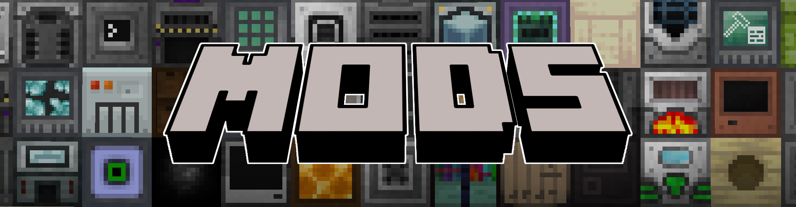

Delivery Inc. is a technical modpack with focus on **automation** and a **completely new take on questing**.

**Delivery Inc. uses a questing system designed specifically for this modpack.**

You run a company that receives orders from other people.
These contracts are exactly matched with the progression of the mods.
Initially, you receive orders by mail, but after a certain level, a computer is available to receive orders by E-Mail.

Contract items can be sent either by letter or by parcel in the mailbox, or later with drones that can send cardboard boxes or barrels to the contractors.

After an order is completed, you receive either a gift or money.
Additionally, you receive experience points, which you can use to unlock items that you can order with the money you earned by completing contracts (_These items are intended to prevent the player from progressing the game without doing quests_).

This pack features **89 hand crafted quests** and **over 50 additional quests** that are randomly generated after completing the main storyline.

This modpack contains only the essential mods and no unnecessary things.
The main focus of the selected mods was performance and stability.

## The Main Mods

**Refined Storage**
The base of all storage and item related things.
It also is mainly needed for large craft jobs, as it can become very tedious, crafting everything over and over again.
Refined storage is introduced very early in the modpack to make item organization a lot easier.

**Mekanism**
Mekanism is a must have when creating a technical modpack.
It is needed as an integral part for power generation and machinery.

**Compact Machines**
The Compact Machine mod is currently still in very early development, but according to our tests it is stable and functional.
It basically enables building farms in a single block and keeping it loaded while nearby.
This also takes a lot of strain from the client as not all farms have to be rendered and processed at the same time, while still having them nearby.

**Oh The Biomes You'll Go**
This mod adds a lot of biomes to every dimension.
It makes Minecraft look like a completely different game.

**YUNG's Better Caves | YUNG's Better Mineshafts**
To make caving a little bit more interesting.

**Pipez**
This mod was created because the pipes from Mekanism are very laggy and can be the nail in the coffin of a server, when building too much.
Note that all Mekanism pipes are disabled by the modpack for this reason.

**Camera Mod**
This mod allows quests to require the submission of images of specific mobs or biomes.

**Botany Pots**
This mod is very powerful in both early game and late game.
These pots basically automate farming every growable crop.
This also includes Mystical Agriculture crops.

**Solar Flux Reborn**
A simple energy source for the early game.

**Resourceful Bees**
Resourceful Bees reduces the early game grind for ores and other materials.
It is introduced very early and was altered in a way that it is not too hard to build early farms.

**Industrial Foregoing**
Industrial Foregoing is also an integral part of every technical modpack.

**Thermal Series**
This mod adds new ores and a few machines.

**Quark**
Quark adds a large variety of features and tweaks.
A must have for every modpack.

**PneumaticCraft: Repressurized**
A mod focused around pneumatics.

**Angel Ring**
The angel ring can be obtained in the mid game and acts as a replacement of the Mekanism jetpack.
This ring enables creative flight in survival mode.

**QuantumStorage**
This mod adds blocks to store a near infinite amount of items and fluids of a single type.
This can be replaced by the infinite storage disk of Refined Storage in later stages of questing.

**Chunk Loaders**
This mod should be self explaining.
It adds chunk loaders in different sizes.
In the interface of these blocks you can set exactly which chunks should be loaded.

**Compressium**
Compressium adds compressing recipes of the most common blocks.

**RFTools Builder**
The Builder can be used as a very powerful quarry, to get to get a large quantity of ores and materials quickly.

**Mystical Agriculture**
This mod is introduced very late in the storyline, because from this point on almost everything can be automated.

  
Complete Mod List

  
  - [Bookshelf](https://www.curseforge.com/minecraft/mc-mods/bookshelf) by DarkhaxDev
  - [Just Enough Items (JEI)](https://www.curseforge.com/minecraft/mc-mods/jei) by mezz
  - [Compressium](https://www.curseforge.com/minecraft/mc-mods/compressium) by DinnerBeef
  - [Default Options](https://www.curseforge.com/minecraft/mc-mods/default-options) by BlayTheNinth
  - [Mekanism Additions](https://www.curseforge.com/minecraft/mc-mods/mekanism-additions) by bradyaidanc, Thiakil,   theCyanideX, Forge_User_31528198, pupnewfster
  - [Sleeping Bags](https://www.curseforge.com/minecraft/mc-mods/sleeping-bags) by henkelmax
  - [Refined Storage Addons](https://www.curseforge.com/minecraft/mc-mods/refined-storage-addons) by raoulvdberge
  - [RFTools Base](https://www.curseforge.com/minecraft/mc-mods/rftools-base) by McJty
  - [Botany Trees](https://www.curseforge.com/minecraft/mc-mods/botany-trees) by DarkhaxDev
  - [CC: Tweaked](https://www.curseforge.com/minecraft/mc-mods/cc-tweaked) by SquidDev
  - [Light Overlay (Rift/Forge/Fabric)](https://www.curseforge.com/minecraft/mc-mods/light-overlay) by shedaniel
  - [Mystical Agradditions](https://www.curseforge.com/minecraft/mc-mods/mystical-agradditions) by BlakeBr0
  - [Ender Storage 1.8.+](https://www.curseforge.com/minecraft/mc-mods/ender-storage-1-8) by covers1624, Chicken_Bones
  - [PackMenu](https://www.curseforge.com/minecraft/mc-mods/packmenu) by Shadows_of_Fire
  - [JEITweaker](https://www.curseforge.com/minecraft/mc-mods/jeitweaker) by Jaredlll08
  - [Resourceful Bees](https://www.curseforge.com/minecraft/mc-mods/resourceful-bees) by epic_oreo, ThatGravyBoat,   VaerysDawn
  - [Storage Drawers](https://www.curseforge.com/minecraft/mc-mods/storage-drawers) by Texelsaur
  - [Refined Storage: Requestify](https://www.curseforge.com/minecraft/mc-mods/rs-requestify) by Buuz135
  - [Industrial Foregoing](https://www.curseforge.com/minecraft/mc-mods/industrial-foregoing) by Buuz135, hrznstudio
  - [Cucumber Library](https://www.curseforge.com/minecraft/mc-mods/cucumber) by BlakeBr0
  - [Architectury API (Forge)](https://www.curseforge.com/minecraft/mc-mods/architectury-forge) by shedaniel
  - [FTB GUI Library](https://www.curseforge.com/minecraft/mc-mods/ftb-gui-library) by FTB, LatvianModder
  - [Immersive Portals (for Forge)](https://www.curseforge.com/minecraft/mc-mods/immersive-portals-for-forge) by   qouteall
  - [Initial Inventory](https://www.curseforge.com/minecraft/mc-mods/initial-inventory) by Jaredlll08
  - [Cloth Config API (Forge)](https://www.curseforge.com/minecraft/mc-mods/cloth-config-forge) by shedaniel,   linkieisbetterthank9
  - [Waystones](https://www.curseforge.com/minecraft/mc-mods/waystones) by BlayTheNinth
  - [Storage for ComputerCraft](https://www.curseforge.com/minecraft/mc-mods/storage-for-computercraft) by uecasm
  - [The One Probe](https://www.curseforge.com/minecraft/mc-mods/the-one-probe) by McJty
  - [RFTools Builder](https://www.curseforge.com/minecraft/mc-mods/rftools-builder) by McJty
  - [Vanilla Hammers [Forge]](https://www.curseforge.com/minecraft/mc-mods/vanilla-hammers-forge) by MelanX
  - [Chisels & Bits](https://www.curseforge.com/minecraft/mc-mods/chisels-bits) by AlgorithmX2, OrionOnline
  - [Runelic](https://www.curseforge.com/minecraft/mc-mods/runelic) by DarkhaxDev
  - [Delivery Questing](https://www.curseforge.com/minecraft/mc-mods/delivery-questing) by henkelmax
  - [Trash Cans](https://www.curseforge.com/minecraft/mc-mods/trash-cans) by SuperMartijn642
  - [Titanium](https://www.curseforge.com/minecraft/mc-mods/titanium) by hrznstudio, Buuz135
  - [RFTools Utility](https://www.curseforge.com/minecraft/mc-mods/rftools-utility) by McJty
  - [Dark Utilities](https://www.curseforge.com/minecraft/mc-mods/dark-utilities) by DarkhaxDev
  - [Mystical Agriculture](https://www.curseforge.com/minecraft/mc-mods/mystical-agriculture) by BlakeBr0
  - [Mystical Customization](https://www.curseforge.com/minecraft/mc-mods/mystical-customization) by BlakeBr0
  - [SuperMartijn642's Config Lib](https://www.curseforge.com/minecraft/mc-mods/supermartijn642s-config-lib) by   SuperMartijn642
  - [Camera Mod](https://www.curseforge.com/minecraft/mc-mods/camera-mod) by henkelmax
  - [Anti Mob Griefing](https://www.curseforge.com/minecraft/mc-mods/anti-mob-griefing) by henkelmax
  - [Compact Machines](https://www.curseforge.com/minecraft/mc-mods/compact-machines) by davenonymous, RobotGryphon
  - [Better Title Screen](https://www.curseforge.com/minecraft/mc-mods/better-title-screen) by Girafi
  - [Patchouli](https://www.curseforge.com/minecraft/mc-mods/patchouli) by Vazkii
  - [Building Gadgets](https://www.curseforge.com/minecraft/mc-mods/building-gadgets) by Direwolf20, Error_MiKeY
  - [PneumaticCraft: Repressurized](https://www.curseforge.com/minecraft/mc-mods/pneumaticcraft-repressurized) by   desht_08, Forge_User_59359881
  - [Pipez](https://www.curseforge.com/minecraft/mc-mods/pipez) by henkelmax
  - [CraftTweaker](https://www.curseforge.com/minecraft/mc-mods/crafttweaker) by Jaredlll08
  - [Refined Storage](https://www.curseforge.com/minecraft/mc-mods/refined-storage) by raoulvdberge
  - [Mekanism](https://www.curseforge.com/minecraft/mc-mods/mekanism) by bradyaidanc, Forge_User_31528198, Thiakil,   pupnewfster
  - [McJtyLib](https://www.curseforge.com/minecraft/mc-mods/mcjtylib) by McJty
  - [YUNG's Better Caves (Forge)](https://www.curseforge.com/minecraft/mc-mods/yungs-better-caves) by YUNGNICKYOUNG
  - [Sophisticated Backpacks](https://www.curseforge.com/minecraft/mc-mods/sophisticated-backpacks) by P3pp3rF1y
  - [Mekanism Generators](https://www.curseforge.com/minecraft/mc-mods/mekanism-generators) by bradyaidanc,   pupnewfster, Thiakil, Forge_User_31528198
  - [Mekanism Tools](https://www.curseforge.com/minecraft/mc-mods/mekanism-tools) by bradyaidanc, Thiakil,   pupnewfster, Forge_User_31528198
  - [CobbleForDays](https://www.curseforge.com/minecraft/mc-mods/cobblefordays) by LexManos
  - [Angel Ring](https://www.curseforge.com/minecraft/mc-mods/angel-ring) by DenisMasterHerobrine
  - [Chunk Loaders](https://www.curseforge.com/minecraft/mc-mods/chunk-loaders) by SuperMartijn642
  - [CodeChicken Lib 1.8.+](https://www.curseforge.com/minecraft/mc-mods/codechicken-lib-1-8) by covers1624,   Chicken_Bones
  - [Solar Flux Reborn](https://www.curseforge.com/minecraft/mc-mods/solar-flux-reborn) by Zeitheron, DragonForgeMC
  - [Akashic Tome](https://www.curseforge.com/minecraft/mc-mods/akashic-tome) by Vazkii
  - [Thermal Foundation](https://www.curseforge.com/minecraft/mc-mods/thermal-foundation) by TeamCoFH, KingLemmingCoFH
  - [JAOPCA](https://www.curseforge.com/minecraft/mc-mods/jaopca) by TheLMiffy1111
  - [CoFH Core](https://www.curseforge.com/minecraft/mc-mods/cofh-core) by TeamCoFH, KingLemmingCoFH
  - [Thermal Expansion](https://www.curseforge.com/minecraft/mc-mods/thermal-expansion) by TeamCoFH, KingLemmingCoFH
  - [Quark](https://www.curseforge.com/minecraft/mc-mods/quark) by Vazkii, wiresegal
  - [Just Enough Resources (JER)](https://www.curseforge.com/minecraft/mc-mods/just-enough-resources-jer) by   way2muchnoise
  - [ServerConfig Updater](https://www.curseforge.com/minecraft/mc-mods/serverconfig-updater) by Darkere
  - [Botany Pots](https://www.curseforge.com/minecraft/mc-mods/botany-pots) by DarkhaxDev
  - [Oh The Biomes You'll Go](https://www.curseforge.com/minecraft/mc-mods/oh-the-biomes-youll-go) by AOCAWOL,   Corgi_Taco
  - [YUNG's Better Mineshafts (Forge)](https://www.curseforge.com/minecraft/mc-mods/yungs-better-mineshafts-forge) by   YUNGNICKYOUNG
  - [ExtraStorage](https://www.curseforge.com/minecraft/mc-mods/extrastorage) by 3divad99
  - [Clumps](https://www.curseforge.com/minecraft/mc-mods/clumps) by Jaredlll08
  - [Extreme sound muffler (Forge)](https://www.curseforge.com/minecraft/mc-mods/extreme-sound-muffler) by LeoBeliik
  - [Click Machine](https://www.curseforge.com/minecraft/mc-mods/click-machine) by Shadows_of_Fire
  - [Nature's Compass](https://www.curseforge.com/minecraft/mc-mods/natures-compass) by Chaosyr
  - [QuantumStorage](https://www.curseforge.com/minecraft/mc-mods/quantumstorage) by GigaBit101
  - [MoreVanillaLib](https://www.curseforge.com/minecraft/mc-mods/morevanillalib) by MelanX
  - [Iron Chests](https://www.curseforge.com/minecraft/mc-mods/iron-chests) by ProgWML6, Alexbegt
  - [AutoRegLib](https://www.curseforge.com/minecraft/mc-mods/autoreglib) by Vazkii
  - [FTB Backups](https://www.curseforge.com/minecraft/mc-mods/ftb-backups) by FTB, LatvianModder
  - [FTB Chunks](https://www.curseforge.com/minecraft/mc-mods/ftb-chunks) by FTB, LatvianModder
  - [Curios API (Forge)](https://www.curseforge.com/minecraft/mc-mods/curios) by TheIllusiveC4
  - [Corpse](https://www.curseforge.com/minecraft/mc-mods/corpse) by henkelmax
  - [Easy Villagers](https://www.curseforge.com/minecraft/mc-mods/easy-villagers) by henkelmax
  - [Extra Disks](https://www.curseforge.com/minecraft/mc-mods/extra-disks) by MelanX
  - [YUNG's API (Forge)](https://www.curseforge.com/minecraft/mc-mods/yungs-api) by YUNGNICKYOUNG
  - [Mouse Tweaks](https://www.curseforge.com/minecraft/mc-mods/mouse-tweaks) by YaLTeR
  - [Torchmaster](https://www.curseforge.com/minecraft/mc-mods/torchmaster) by xalcon
  - [Shutup Experimental Settings!](https://www.curseforge.com/minecraft/mc-mods/shutup-experimental-settings) by   Corgi_Taco, rdvdev2
  - [Placebo](https://www.curseforge.com/minecraft/mc-mods/placebo) by Shadows_of_Fire

